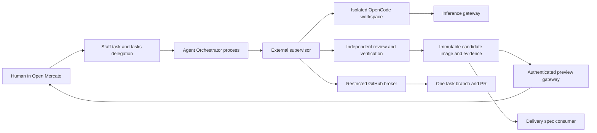

# Agent execution and verified previews

**Date**: 2026-09-19
**Status**: Draft
**Scope**: Specification only. Execution capability; delivery is a separate consumer.
**Companion**: [Instance delivery and recovery](2026-09-19-instance-delivery-and-recovery.md)
**Decisions and sources**: [Package map](2026-09-19-instance-development-infrastructure.md), [accepted decisions](2026-09-19-instance-development-decisions.md)

## TLDR

An authorized user delegates an existing staff task to Open Mercato Developer. Agent Orchestrator coordinates a separate OpenCode coding environment, independent review, tests, a PR, and an authenticated preview. The result is a versioned, immutable candidate with evidence that the delivery capability can consume. This capability never merges or deploys the hosting instance.

## Problem Statement

The existing factory designs delegate tasks but place code review in GitHub and describe transient runner execution. They do not fully define parallel execution against the hosting instance's source, trustworthy cost admission, checkpoint recovery, or a tested immutable artifact. A person needs to see both the proposed change and its behavior without leaving Open Mercato, while agent code cannot access live data or privileged controls.

## Overview and Success Measures

Primary outcome: a delegated fixture task produces one PR and an inspectable, tested candidate without manual terminal work. Baseline: unknown; the existing designs and locally booted app do not demonstrate this flow.

Qualification targets: two concurrent runs and two previews cannot access each other's resources; every mutation has one durable operation ID; zero calls admitted above reserved inference limits; a duplicated delegation produces one process; new code always invalidates prior candidate evidence. User-visible acceptance and rejection of delegation should appear within ten seconds under a healthy local stack. Establish measured CPU/RAM/storage requirements during qualification, not through an invented VPS size.

Prior art: adopt OpenHands' external controller/per-run runtime separation; retain OpenCode as the only coding harness. Reuse staff and Agent Orchestrator instead of introducing another board or workflow engine. Official source links and evidence boundaries are in the package map.

## Goals

| ID | Required behavior |
|---|---|
| EX-01 | Start exactly one fenced process from an authorized staff-task delegation. |
| EX-02 | Execute parallel isolated runs under a frozen profile and host resource policy. |
| EX-03 | Enforce attempt/time/daily budgets, manual budget resume, and explicit instruction delivery. |
| EX-04 | Recover checkpoints, waits, and external operations without duplicate effects. |
| EX-05 | Produce an independently reviewed, verified immutable candidate and a single associated PR. |
| EX-06 | Display complete change evidence and authenticated sleeping previews inside Open Mercato. |
| EX-07 | Retain necessary audit evidence and safely clean up terminal resources. |

## Non-goals

Merge/deployment, WordPress, automatic intake, autonomous delegation of decomposition subtasks, support for multiple coding harnesses, arbitrary target repositories, access to production credentials, full E2E on every change, and framework/orchestrator/toolchain upgrades through this execution path. No replacement task model or orchestrator. No local tunnel or unauthenticated localhost preview.

## Proposed Solution

Extend `tasks`, which already owns delegation and task-change records. Use its `kind=code` change record to reference the execution attempt and candidate, rather than introducing a second change-set aggregate. Package this module for installation into an existing Open Mercato instance; ship trusted infrastructure separately as a Docker Compose package. Development paths below are relative to this repository; distribution does not require shipping the full application source as a new platform fork.

The infrastructure package has a trusted supervisor, GitHub broker, inference gateway, preview gateway, and isolated run/build/verification environments. These are explicit privilege/process boundaries, not separate business modules. Implement shared persistence in one supervisor database and ordinary service code; avoid a generic plugin bus or new orchestration engine. A local OCI image store retains content-addressed artifacts. Docker/BuildKit access exists only in the supervisor's trusted builder boundary; never in the coding container or app.

### Design Decisions and Alternatives

| Decision | Rationale | Alternative | Why deferred |
|---|---|---|---|
| Staff task + tasks execution extensions | Existing ownership and ACL | New Kanban/task entity | Duplicates SPEC-002. |
| Agent Orchestrator + supervisor | Reuse durable process decisions; isolate host control | App owns Docker socket | Lets generated application code control host infrastructure. |
| Credential-free coding sandbox + broker | Enforce operation restrictions | Contents-write token in sandbox | The same permission can permit merging. |
| Repository profile intersected with host policy | Reproducibility without privilege expansion | Execute arbitrary Compose from the task branch | Can request host mounts, privileged containers, or live secrets. |
| Strict inference admission gateway | Parallel limits need atomic reservations | Read usage stream and abort | Already-started requests can exceed a cap. |

## Domain Vocabulary and Business Rules

| Term | Meaning / invariant |
|---|---|
| Instance | One running application and its configured source repository/base branch, with an immutable installation ID. It is a shared code deployment boundary across its tenants. |
| Delegation | SPEC-002 task-to-agent assignment; one active generation. Stale generations cannot mutate task state or create effects. |
| Attempt | One bounded execution allocation for a task/delegation, including its phase sessions. Review fixes create another attempt, keeping task, branch, and PR. |
| Candidate | Frozen source tree, image digest, profile, verification manifest and review; any mutation creates a new candidate. |
| Protected path | Host-owned policy class covering factory controls, CI credentials, workflow definitions, framework/orchestrator, base images and toolchain. Changes may produce a proposal PR but cannot become an automatically deliverable candidate. |
| Wait | Durable human question, plan approval, budget pause or infrastructure dependency. Waiting consumes no active-work time or inference. |
| Review round | Independent review followed by at most one bounded repair attempt. Maximum three automated repair rounds across the delegation; separate one CI repair. Counters survive retries and manual resumes. |

Default attempt caps: small 20 active minutes/USD 2, medium 60/USD 10, large 120/USD 20. Active time accumulates monotonic running intervals across research/design/coding/review/build/test phases; queue, human wait, preview sleep, and service outage waits do not count. A host crash closes the last interval conservatively at lease expiry. Provider calls already in flight remain financially reserved while waiting.

Instance pool: USD 20 per Europe/Warsaw day, 80% warning, administrative override. No aggregate task cap. Use integer micro-USD, never binary floating point. At request admission reserve a conservative upper bound in one transaction against both attempt and daily balances; settled spend plus outstanding reservations cannot exceed either cap. Bound all billed input/output/reasoning/tool dimensions using pinned provider pricing and hard provider token limits. Unsupported/unbounded billing models are refused. Charge calls to their admission day; midnight never releases an in-flight reservation. Unknown settlement retains the reservation until reconciliation. Gateway retries get distinct charged request IDs only after resolving the prior request or reserving its worst case. All orchestrator research/design and reviewer model calls use this gateway too, not just coding.

Local pricing estimates are not a guarantee about arbitrary provider invoices. Provider/account compatibility and usage reconciliation must pass qualification before a hard-cap claim. Provider price drift, unknown usage, or an unaccounted bypass pauses admission; do not silently switch to a soft cap. Host/cloud/storage charges are outside the inference pool and displayed separately if tracked.

Sizing is the maximum of model recommendation and protected deterministic rules. Proposed defaults: small requires no schema/dependency/auth/payment/public-contract change and at most five files in one business module; any such risk signal requires a human plan gate and at least medium; cross-module change or estimated effort beyond medium requires large. Before editing, unknown paths or acceptance criteria trigger clarification. Exceeding the approved path/risk/size envelope pauses and asks for a revised plan. Protected changes are proposal-only. An oversized task produces a human-approved decomposition; create idempotent staff subtasks and delegate only the first independent slice. Others remain without agent delegates.

## Users, Permissions, and Scope

Every business row has trusted `tenant_id` and `organization_id`; resolve them from the authenticated task, never runner payloads. Execution service identities are scoped to installation, delegation, run, and monotonically increasing fence. No cross-module ORM relationships.

| Actor | Feature and additional conditions |
|---|---|
| Task reader | `tasks.view`, actual task access, plus `tasks.code.view` for source diffs and code artifacts. Source visibility can disclose shared application code beyond one tenant. |
| Delegator | `tasks.delegate`, task access, plus administrator-assigned instance developer enrollment. A tenant role alone cannot authorize changes affecting the whole instance. |
| Instructor / resumer | `tasks.runs.control`, task access and enrollment; owner/author without this feature is insufficient. |
| Snapshot requester | `tasks.snapshots.use` plus separately recorded source-data-owner consent for this attempt and allowed data scope. |
| Settings operator | `tasks.infrastructure.manage` plus instance administrator enrollment. Secrets are configured externally, never returned by the settings API. |
| Process principal | `tasks.process`, exact installed workflow grants; never inherits the initiating human's credential. |
| Reviewer agent | Read-only candidate checkout and scoped inference capability; cannot alter candidate or approve deployment. |

Enrollment and the allowed tenant/org binding are maintained by the external installation administrator. Task ACL remains an additional gate. If staff or Agent Orchestrator is absent/incompatible, disable delegation with a named dependency error; preserve ordinary staff operation. A module UI guard alone does not grant host authority.

## Reuse and Ownership Map

| Capability | Owner and integration |
|---|---|
| Tasks, board, assignee, comments, references | Core staff, reused by SPEC-002; tasks commands remain the only process status writer. |
| Delegation/change row/run events | Extend tasks, reuse SPEC-002/003 IDs and stale-write guards. |
| Process milestones, human design decisions | Agent Orchestrator and workflows; seeded owned DB definition and explicit grants. |
| Run lifecycle, quotas, checkpoint/resource ownership | External supervisor; tasks stores projections, not competing authority. |
| Candidate business reference / evidence display | Tasks references supervisor candidate manifest and attachments by digest. |
| Inference admission | Gateway and supervisor budget ledger, shared by all factory agent phases. |
| Docker, builds, GitHub writes | Supervisor-owned restricted services; unavailable as arbitrary model tools. |

## Architecture and Data Flow



Local topology: application and infrastructure bind all published sockets to loopback explicitly, including IPv6 where enabled. Preview backends, databases, Redis, agent servers, Docker daemon, and Caddy admin API are not public endpoints. Existing project Compose defaults are not proof of this desired topology. Containers communicate on explicit private networks. VPS topology retains service contracts but adds administrator-provisioned TLS, domain routing, firewall, backup destination and secret store before remote access. This spec neither selects Contabo nor assumes VM-level isolation inside Docker.

Run envelope `schemaVersion=1`: installation/task/delegation/process/workflow IDs, attempt ID, fence, idempotency key, repo ID/base SHA, profile digest, risk/size and approved plan digest, accepted task revision, permitted data seed reference, limits, and callback correlation. Never accept a caller-supplied repository URL, Docker options, command URL or credential. Supervisor validates the envelope against external installation policy.

Repository execution profile proposes named commands (`install`, `generate`, `typecheck`, `lint`, `dsCheck`, `test`, `build`, `integration`, `health`), approved service image digests, app port, fixture/migration manifest, resource requests and changed-path test map. Host policy caps each value. Resolve and freeze the profile from the trusted base; changes to the profile require administrator admission for a later run, not a privilege change during this run. Repository shell commands and install hooks remain untrusted code executed only in the sandbox. Build inputs are the exact Git tree, lockfile and approved base/toolchain digests; no credential-bearing home mounts or Git hooks from the host.

### Orchestrator contract

Reuse `tasks.task.delegated` and `agent_orchestrator.processes.startExecution` with `task:{taskId}:{delegationId}` idempotency. Declare only the required manual process trigger, not a second matching event trigger. Seed an owned workflow database row with `workflowDefinitionAuthoring.upsertOwnedDefinition` and exact grants; process starts must not depend on a missing initiating human. Reuse the single-option plan/decomposition approval convention and explicit non-approved outcome branches from SPEC-001.

The runner request is a short acknowledged dispatch, not a long-running workflow activity. A durable supervisor outbox delivers completion only to the linked workflow wait generation. Early `409` signals retry with bounded backoff; persist outcome before signal and record acknowledgment after successful consumption. Never treat a socket timeout as proof of failure or blindly repeat a signal. Reconcile workflow step/generation and accepted event ID, otherwise mark `needs_attention`. The application adapter needs a durable inbox keyed by operation/event ID before forwarding to the core signal endpoint. Raw core signal acknowledgment alone is not an exactly-once contract. Include `receiptId` in the flat signal payload and reconcile it against persisted `SIGNAL_RECEIVED` event data after an ambiguous send. A single relay serializes each wait generation; callback and watchdog atomically compete for that wait. Matching replay returns 202, same key/different hash returns 409, and a late completion after timeout stays audit-only. Payloads contain IDs and safe result summaries because core signal events persist them.

Installed 0.8.0 has two start crash windows: ProcessInstance can be committed before queue enqueue, and WorkflowInstance can be inserted before its ID is linked back to the process. A retry of startExecution alone does not close either window. Centralize coupling in one version-pinned `factoryOrchestratorBridge`, not scattered framework imports. Before any re-enqueue, a reconciler under a process lease queries same-scope workflow correlation `process_execution:<processInstanceId>`: one match means reconcile/relink, zero means requeue only after proving no starter is in flight, multiple matches mean stop and repair. Qualification must cover both crash windows and concurrent starter ownership; no exactly-once process-start claim is permitted before these tests pass. Use a stable stored process-definition ID plus ownership marker, refuse seed collisions, and verify its workflow/grants. There is no observed owned-process upsert equivalent to the owned-workflow service.

Direct command invocation does not execute the HTTP route's `manual.requireFeatures` and mutation guards. The delegation command/bridge must enforce equivalent authority and current installation admission explicitly, re-read the active delegation, and compare canonical input hashes on idempotent replay. `initiatedBy` records provenance, not execution grants. Restrict workflow seed grants to a static reviewed allowlist.

Use supervisor deadlines/watchdogs for run and human-wait resource actions. Do not depend on `WAIT_FOR_SIGNAL.timeout` being enforced merely because it is accepted in configuration. A completed child operation survives application downtime and is replayed from the outbox after restart. No timer promises background execution while the laptop is asleep.

### State and recovery

Run states: `queued -> preparing -> running -> verifying -> candidate_ready`; alternatives `waiting_human`, `waiting_plan`, `paused_budget`, `paused_capacity`, `recovering`, `failed`, `cancelled`, `needs_attention`. A reason plus resume target is mandatory for waiting/paused states. `candidate_ready` ends active compute, not the delegation when delivery is enabled.

An external lease owns each run/fence. Persist desired resource operations before execution, attach labels with run/fence/operation IDs, and reconcile observed resources on restart. Queue redelivery cannot allocate a second workspace or PR. Late results from an older fence are recorded as stale and cannot advance the process.

After 30 minutes waiting for a human, freeze/stop processes, persist writable workspace, repository state including uncommitted files, OpenCode state, instruction journal and digest manifest on durable volumes; release CPU/RAM/slots. Resume with the same pinned harness/profile and verify digests. Corruption or ambiguous in-flight external effects requires attention. A read-only replay of the session transcript is not sufficient recovery. A budget pause never resumes automatically after reset. Resume has two explicit modes: `continue_attempt` is allowed only when that attempt still has active-time and inference allowance and the daily pool admits it; `new_attempt` requires the human to confirm the next size-based allowance and creates a new bounded continuation attempt from the checkpoint. Use `new_attempt` when the prior attempt's time or dollar cap is exhausted, even when no candidate exists. Keep task/delegation/branch/PR, approved scope, recovery journal and cumulative review/CI-repair counters; do not reset those counters by buying another attempt. The UI shows prior spend and the new allowance before confirmation. Neither mode automatically raises the daily pool. Outstanding reservations remain charged to their original attempt and admission day until settled; a continuation cannot release or reassign them to gain headroom. Cancel stops compute, fences pending callbacks, retains audit and marks the candidate unusable; it does not silently close a PR or delete history.

Instruction states: `accepted`, `queued`, `delivering`, `acknowledged`, `applied`, `rejected`, `delivery_uncertain`. Persist a client request ID and text hash before delivery; send between bounded steps, not concurrently into an ongoing prompt. Session-message correlation determines acknowledgment. If delivery is ambiguous, inspect persisted session messages; do not resend blindly. `applied` requires the next agent step to acknowledge the instruction ID; this means consumed, not that its requested result has been accepted by tests. Comments never call this path.

### Candidate contract v1

One canonical JSON manifest, persisted immutably by the supervisor and hashed with SHA-256, binds:

- schema version; installation/task/delegation/attempt/candidate IDs and fence;
- immutable repository ID, base branch and `baseSha=B`, PR head `headSha=H`, `treeSha=T` (tree of H), PR number and branch;
- image digest and platform, profile digest, base/toolchain digests, lockfile digest, build-recipe digest and build provenance;
- plan/risk/changed-path manifest, protected-path verdict, migration manifest digest, expected previous deployment ID;
- verification artifacts with checks, exit codes and time bounds, trusted verifier identity, evidence digests; independent reviewer session and verdict bound to H/T;
- preview image/dataset identity, consent expiry if used, and supported delivery protocol version.

H must contain B as an ancestor before final verification. Build H once; run preview and API/browser tests against its image digest, with unit/static checks bound to the same tree/toolchain. Do not accept agent-authored success JSON as verification proof: the supervisor launches approved verifier commands and records process outcomes, artifact hashes and candidate identity. Tests in the candidate remain reviewable code and can be misleading; protected baseline checks and independent reviewer assessment are additional gates, not mathematical correctness proof.

No missing required check, unresolved blocking finding, secret-scan failure, unsigned/unknown provenance, protected-path modification, expired data consent or incomplete file inventory can produce `candidate_ready`. Binary files show type, size and digest; no invented text diff. Generate full diffs from trusted Git objects, paging large content; GitHub truncated patches cannot be the sole source. Secrets are redacted; if full safe review is impossible, block automatic delivery and show why.

The broker owns clone/fetch/export, branch push and PR creation. It creates a deterministic task branch and reconciles by repository + head/base + operation marker before retry. GitHub installation tokens never leave the broker. It rejects other repositories/branches, force pushes, base updates, merges, releases, workflow-file changes and unrestricted URL proxying. Git object ingestion rejects path traversal, hooks, unsafe submodules/LFS destinations and unexpected credential URLs. Application dependency changes need plan/security review; privileged CI execution must not be triggered by agent-modified workflow code.

Before the first push or PR, installation qualification inspects every reachable `push`, `pull_request`, `pull_request_target`, `workflow_run`, reusable-workflow and downstream deployment path. Unchanged workflows can still execute attacker-controlled install hooks, tests and scripts. Publication is blocked unless that unreviewed code runs without repository/environment secrets, writable GitHub tokens, privileged self-hosted runners, production network access, or reusable trusted caches/artifacts. Privileged downstream jobs cannot consume untrusted artifacts or code without their own reviewed promotion gate. A default GitHub-hosted runner is not sufficient proof. Required checks must have a qualified unprivileged lane; if the repository cannot supply it, retain a local proposal/evidence and mark publication blocked. Never push first to discover whether privileged CI runs.

## User Journeys

J-EX-1: Staff board -> task drawer -> choose Open Mercato Developer -> delegated badge -> plan/clarification when needed -> live run -> Changes panel -> diff, verification and preview. Request changes creates a bounded new attempt on the same branch/PR. The prior candidate remains historical, never approvable.

J-EX-2: Agent asks a question -> authorized human submits an explicit instruction -> queued/delivered/consumed status -> run resumes from checkpoint. Ordinary task comments leave the agent unchanged. Budget exhaustion shows cap, spend and outstanding reservations with a manual Resume action that rechecks capacity and budget.

J-EX-3: Preview is asleep -> authorized user selects Wake preview -> image/dataset restored -> gateway rechecks task access. Lost permission, expired consent or cleaned resources blocks wake and explains the reason. Reviewer edits inside the preview cannot mutate the candidate image; data resets require a new dataset identity.

## UI and Interaction Contracts

Reference: [example task list page](../../src/modules/example/backend/todos/page.tsx), [TodosTable](../../src/modules/example/components/TodosTable.tsx), and [backend UI guide](../guides/backend-ui.md). Reuse staff's board/drawer, not the example business model. SPEC-003 establishes `detail:staff:staff_time_task:tabs` as a drawer panel host; verify the installed host during implementation.

| Surface | Data / mutations | Components and actions |
|---|---|---|
| Staff task drawer Changes panel | Existing changes read, execution summary | Injection widget, task/delegate status, Open run, View diff, Preview. |
| `/backend/tasks/{taskId}/runs` | Execution/evidence reads; instruction/resume/cancel | `Page`, `PageBody`, `DataTable` for attempts/files/checks; grouped status detail, explicit command dialogs. |
| Candidate view inside run page | Candidate-scoped diff/evidence | Accessible read-only diff, file navigation, checks, reviewer findings, authenticated preview. No new standalone editor. |
| `/backend/settings/tasks/infrastructure` | Non-secret installation status and policy projection | `CrudForm` for editable approved limits, scoped option sources for references; external admin-owned restrictions read-only. |

```text
Task WEB-12    Human assignee    Agent delegate    Run state
Attempt selector    Time / spend / reservations    [Send instruction]
Files | Diff | Checks | Reviewer | Preview
Selected candidate version and base revision
[Request changes] [Cancel run]    [Wake preview]
```

A source diff is a purpose-specific read-only component because `DataTable`/`CrudForm` do not render line hunks. Use standard page/buttons/dialogs and semantic tokens around it. Preview is a separate origin embedded only if frame policy permits; otherwise open an in-app browser surface. Never serve candidate JavaScript under the control application's origin or pass its session token to it. Local HTTP cookies are host-scoped, not port-scoped: a mere localhost port offset is insufficient isolation. Qualification must establish distinct loopback hostnames/origins and host-only cookies before authenticated preview is enabled, with local TLS when needed for browser security features. TLS alone does not separate same-host cookies. Keep the control app and each preview on distinct hostnames; no parent-domain cookies. Gateway session state is scoped to that preview and never forwarded to the candidate backend.

All surfaces specify loading, empty, transport failure, permission denied, expired artifact, paused budget, conflict, stale candidate, recovery and success states. Preserve instruction text on errors. Shared `apiCall` helpers, guarded custom mutations and `updatedAt` headers; Cmd/Ctrl+Enter submits, Escape cancels, focus returns to trigger, status changes use non-disruptive announcements. Narrow layouts use stacked sections and scrollable diff, with keyboard file navigation and text labels. Use `tasks.*` translations and semantic tokens in light/dark modes. Task references and users are displayed by names, never typed UUIDs. No transcript or secret value appears in ordinary UI.

Preview gateway authorizes every request, including asset/websocket handshake, against authenticated identity plus current task access and candidate validity; fail closed when authorization is unavailable. Bound open websocket reauthorization to 30 seconds and close immediately on revocation events. Preview idle means no authenticated interactive request/heartbeat for 30 minutes; health probes do not keep it alive. Sleeping preserves volumes/image and releases preview compute slots; waking queues fairly when the separate preview limit is full. Code artifacts require `tasks.code.view`; preview requires task access and `tasks.view`.

## Data Models

All app-owned rows use UUID IDs, trusted tenant/org columns, timestamps; user-editable records expose `updated_at` and API `updatedAt`. Cross-module references are scalar IDs. Supervisor-owned rows use immutable installation ID plus task/delegation scope. A tasks read model is not a second authority for budget or resource state.

| Record | Minimum fields and uniqueness | Ownership / retention |
|---|---|---|
| Execution attempt | task/delegation/process/workflow IDs, ordinal, fence, state/reason, profile/plan digest, budgets, counters, checkpoint reference, updatedAt; unique delegation + ordinal | Supervisor authoritative; scoped tasks projection. |
| Instruction | run, clientRequestId, content hash/encrypted text, status, provider message correlation; unique run + request ID | Tasks durable command, supervisor delivery journal; body removed at terminal cleanup, audit hash retained. |
| Candidate | immutable v1 manifest/hash, validity reason, change row ID | Supervisor artifact; tasks `code` row references it. No generic CRUD edits. |
| Resource journal/outbox/inbox | operation ID, fence, desired effect, observed resource ID, acknowledgment | Supervisor and application adapter, each unique operation/event ID. |
| Budget day/request | installation/day zone, cap, settled/reserved micro-USD, attempt and phase/request IDs, pricing version | Supervisor gateway ledger; durable, transactionally updated. |
| Snapshot consent | actor/scope/source, sanitization recipe, purpose, expiry, attempt binding, revokedAt | Encrypted metadata; source secrets never copied. |

Store task text, instructions, evidence containing data and consent details through module encryption/attachment conventions. Never store provider keys, raw GitHub tokens or application session cookies here. No raw transcript upload by default; sanitized diagnostic artifacts require administrator access and are deleted with run resources. Audit retains IDs, decisions, amounts, hashes and outcomes, not prompt bodies or data snapshots. Audit retention defaults to 90 days, administrator configurable separately from seven-day cleanup; audit for active rollback/deployment references cannot be purged until those references are released.

## API, Command, and Error Contracts

Proposed additive routes, not installed capabilities. All public methods declare per-method metadata/OpenAPI and zod validation. Authenticated session scope resolves the task first; inaccessible IDs return 404. Standard 401/403 for authentication/feature denial, 400 validation, 409 version/state/idempotency-payload mismatch, 410 expired artifact, 429 quota/capacity, 503 unavailable dependency. Errors expose stable codes and safe messages.

| Method / path | Input | Result / guard | Requirement |
|---|---|---|---|
| GET `/api/tasks/executions?taskId=...` | scoped task, cursor, pageSize <=100 | attempt summaries + updatedAt; `tasks.view` | EX-01, EX-06 |
| GET `/api/tasks/executions/{id}` | ID | state, candidate refs, spend, pending decision | EX-03, EX-04 |
| POST `/api/tasks/executions/{id}/instructions` | clientRequestId, text <=16 KiB, expectedVersion | 202 instruction ID/status; control feature, optimistic lock | EX-03 |
| POST `/api/tasks/executions/{id}/resume` | requestId, expectedVersion, mode (`continue_attempt` or `new_attempt`), confirmedSize for new attempt | 202 or budget/scope/state conflict; explicit next-attempt cap | EX-03, EX-04 |
| POST `/api/tasks/executions/{id}/cancel` | requestId, expectedVersion, reason | 202 fenced cancellation | EX-04 |
| POST `/api/tasks/executions/{id}/request-changes` | requestId, candidateId, expectedVersion, instructions | 202 new attempt, same PR; invalidates candidate first | EX-05 |
| GET `/api/tasks/candidates/{id}` | ID | immutable manifest summary, validity and evidence | EX-05 |
| GET `/api/tasks/candidates/{id}/diff` | path, cursor, bounded page size | escaped text hunks + complete file inventory; code.view | EX-06 |
| POST `/api/tasks/candidates/{id}/preview` | requestId | 202 wake status or 200 gateway entry; task ACL | EX-06 |
| GET `/api/tasks/infrastructure` | none | safe policy/health projection; infrastructure.manage | EX-02 |
| PATCH `/api/tasks/infrastructure/limits` | expectedVersion, bounded limits | 200 updatedAt, audit; cannot exceed host policy | EX-02, EX-03 |

Routes invoke commands (`tasks.execution.instruct/resume/cancel/request_changes`, `tasks.infrastructure.update_limits`) with optimistic guards and post-commit effects, not direct network calls in DB transactions. Existing delegation/changes/events routes remain valid; execution reads are projections rather than a competing event stream. Internal supervisor API `/v1/runs` supports idempotent admission; `/v1/runs/{id}/instructions`, `/cancel`, `/resume` accept scoped service capabilities and fence. These routes are not browser-accessible and do not accept arbitrary shell/network parameters.

Snapshot consent is an explicit command `tasks.execution.consent_snapshot` before allocation, requiring actor, attempt, source scope, purpose, recipient/output scope, recipe digest and expiry. Expiry/revocation stops dependent compute and preview, removes copied data and invalidates the candidate data evidence. A new consent does not resurrect deleted data without a new sanitized copy. The source export runs through a separately authorized data adapter; a run never gets live DB credentials.

Consent binds not only source rows but recipients and outputs: named model provider/account region where known, permitted run/preview/evidence users, purpose, expiry, external retention terms and allowed data classes. If an approved external provider retains data beyond local consent expiry, disclose that limit before consent; local revocation does not promise deletion from that provider. Refuse disclosure when those retention terms exceed the consent. Default snapshot use is preview/isolated verification only; coding/reviewer model contexts use synthetic or separately sanitized summaries. Provider disclosure of snapshot content requires explicit consent naming that recipient; no outbound raw snapshot through prompts/tools by default. Never publish snapshot-derived row data, identifiers or attachments into Git, PR text, image layers, build context, dependency caches or public CI artifacts. Build images from a clean source-only checkout; attach the consented dataset only at runtime. Evidence must be sanitized, scoped and expiry-bound; screenshots count as data copies. Run publication gates scan tracked/untracked files and PR/artifact payloads for data leakage and fail closed on uncertainty. Expiry deletes dataset and derivative evidence volumes/objects, preserving only non-sensitive digests/receipts; a detected prior external disclosure is an incident requiring recipient-specific remediation, not a claim that deleting a local volume erased Git or provider retention.

## Events, Jobs, Notifications, and Cross-Module Flows

Reuse `tasks.task.delegated` and SPEC-003 `tasks.run.progress`/`tasks.change.updated` as UI notifications. Internal new events `tasks.execution.updated` and `tasks.candidate.ready` carry IDs, scope, fence, revision, and event ID only; no instructions or secrets. Persist state first, publish through outbox afterward. DOM SSE is an invalidation signal; clients refetch authorized state after reconnect.

Application adapter callbacks contain eventId/runId/fence/status/manifest digest, authenticated by the supervisor's scoped identity; derive task scope from stored binding. Watchdogs reconcile active leases, overdue waits, pool settlements and GitHub operations. Use installed queue worker contracts for application work; supervisor orchestration uses its durable operation journal, not a second business-process graph.

Notifications: clarification, plan review, 80% warning, budget pause, candidate ready, recovery attention; deduplicate on event ID and audience. No email or third-party messages are necessary.

## Security, Privacy, and Compliance

Threat model: repository code, task text, model output and candidate web content are untrusted. The host administrator, protected supervisor build, configured identity authority and reviewed installed application are trusted. This does not claim container escape resistance against a hostile kernel exploit, or that an already-compromised hosting app cannot abuse its own runtime DB credentials. Do not sell the local/VPS topology as hostile multi-tenant compute hosting.

Sandbox: non-root, dropped capabilities, no-new-privileges, default seccomp, bounded CPU/RAM/PIDs/storage/time, no Docker socket, host networking, device mounts, host home or production environment. Only per-run checkout/data volumes; per-run databases/users, queues, caches, search indexes, uploads and mail sink. Deny network routes to host/control services, production databases and metadata endpoints; enforce egress through explicit dependency/inference gateways. DNS rebinding and redirect destinations are checked. Agent permissions are usability controls, not isolation.

Run/build/preview secrets are synthetic and unique. Provider keys remain in the gateway; GitHub private key and installation tokens remain in the broker; signing/deploy credentials remain in delivery infrastructure. Preview cannot reach control APIs or replay the user's session. Candidate app handlers have no trusted control-plane mounts.

Dependency lifecycle scripts and tests execute with the same untrusted boundary. A profile cannot grant secrets or change the protected-path policy. Independent reviewer gets fresh context (task, plan, diff, evidence), no approval capability and no writer session history. Findings are structured with blocking/nonblocking classification, paths and rationale; all blocking findings must close against the current candidate.

## Integration Coverage

Use self-contained fixtures for two tenants, task readers/controllers, a stub GitHub server, fake-priced inference provider, fault-injectable supervisor and two sandbox runs. No paid API call is needed for deterministic conformance tests. Provider compatibility qualification is separate and cannot silently spend real budget.

| Test | Actions and oracle |
|---|---|
| EX-T01 | Delegate twice, redeliver event, then undelegate/redelegate; one process per generation; stale callback rejected. Missing staff/orchestrator disables only delegation. |
| EX-T02 | Two runs attempt cross-volume/network/DB access, Docker socket and forbidden egress; all refused. Profile edits cannot expand permissions; changed protected path never becomes ready; unsafe unchanged CI prevents push/PR before any external trigger. |
| EX-T03 | Concurrent inference requests, unknown usage, retries and midnight crossing: reservations never exceed limits; every phase charged; budget pause survives day reset until authorized resume; exhausted attempt with no candidate can explicitly create a continuation attempt without resetting review/CI counters. |
| EX-T04 | Question and instruction with duplicate IDs; crash before/after provider message acceptance; show truthful delivered/uncertain state; never duplicate steer. Comments cause no delivery. |
| EX-T05 | Crash at allocation/checkpoint/push/PR creation/signal acknowledgment; recover exactly one effect or stop needs_attention. Early signal retries without losing result; both process-start crash windows and concurrent starter recovery must either relink one workflow or stop before dispatching duplicate external work. |
| EX-T06 | Change candidate after review, red CI, three review repairs, one CI repair, protected dependency change: stale/missing proof blocks ready; approved fixes retain task/branch/PR. |
| EX-T07 | API and browser: diff/file/check views, binary/large/redacted files, stale versions, cross-tenant IDs, ordinary reader vs code reader, malformed callback. Every proposed read/write route gets allowed/denied cases. |
| EX-T08 | Sleep at 30 minutes, revoke ACL during websocket, lose auth service, expire snapshot, wake at capacity, local origin cookie attack: no unauthorized preview request or secret leak; same-host TLS is rejected as cookie isolation and consent cannot leak copied data into prompts/Git/images/evidence; fixtures copy a snapshot row into a commit, image layer and screenshot, and publication must refuse or remove each unauthorized derivative. |
| EX-T09 | Terminal age reaches seven days during wake/rollback pin race: cleanup claims only unreferenced generation; preserve audit and pinned artifacts. |
| EX-T10 | User approves decomposition; first slice delegates once, other staff subtasks remain undelegated; scope/risk expansion pauses. |
| EX-T11 | UI fixture covers settings, drawer, run page, diff and dialogs in light/dark/narrow layouts; keyboard, conflict recovery, names instead of IDs, no raw transcript. |

## Implementation Phases

These phases define future work, not authorization to implement it. Each includes its own UI/API integration evidence; no deferred integration bucket.

### EX-P1: authorized delegation and isolated bounded execution

Depends on SPEC-002 ownership contracts and a compatible installed orchestrator. Add installation/profile validation, scoped attempt state, process adapter, external supervisor journal, gateway admission, sandbox isolation, and minimal run status view. Deliver a fixture task that enters an isolated environment and returns a verified operation result; concurrent/duplicate/denied runs must be safe. Close EX-01/02/03 with EX-T01/02/03/10 plus relevant EX-T07/11 cases. Individual steps: schema/command + replay tests; supervisor/gateway + boundary tests; orchestrator/run view + end-to-end delegation. Exit: two independent runs under fixed budgets and no privileged credentials inside them.

### EX-P2: human interaction and recovery

Depends on EX-P1. Implement instruction commands/UI, checkpoints, leases/fences, durable inbox/outbox, deadline reconciliation, cancellation and manual budget resume. Close EX-04 and remaining EX-03 cases with EX-T04/05 and mutation/UI coverage. Exit: restart at every external-effect boundary converges or clearly requires attention, with no duplicated effect.

### EX-P3: reviewed candidate, PR, diff and preview

Depends on EX-P2. Implement broker publication, immutable builder/verifier, reviewer sessions/counters, candidate manifest, file/diff UI, authenticated preview lifecycle and consented snapshot adapter. Close EX-05/06 via EX-T06/07/08/11. Steps: frozen candidate plus trusted evidence; same-PR repair/review; gateway/preview and UI. Exit: a fixture change is independently reviewed, tested and visible entirely in OM; a delivery consumer can verify the manifest without an agent session.

### EX-P4: retention and portable installation

Depends on EX-P3. Add cleanup claims/pins, redaction/retention and install/upgrade diagnostics for existing local installations, then qualify equivalent single-VPS topology with no public control sockets. Close EX-07 via EX-T09 and repeat isolation/preview tests for the target topology. Exit: terminal cleanup is safe under races, installation docs list actual measured resources and dependencies. Local acceptance does not imply the VPS qualification passed.

Every phase: Corepack Yarn generate/typecheck/lint/ds:check/test/build and relevant `test:integration:ephemeral`; no DB reset or migration merely to validate. Infrastructure tests additionally exercise fake provider/GitHub and Docker boundaries. Configuration currently lists these app gates; respect the pinned Yarn version.

## Requirement Traceability

| Requirement | Journey / contract | Phase | Test | Acceptance |
|---|---|---|---|---|
| EX-01 | J-EX-1, delegation/process adapter | P1 | T01 | A01 |
| EX-02 | installation/profile, run admission | P1 | T02 | A02 |
| EX-03 | J-EX-2, budget/instruction commands | P1-P2 | T03/T04/T10 | A03 |
| EX-04 | J-EX-2, journal/wait/fence | P2 | T05 | A04 |
| EX-05 | J-EX-1, candidate v1/broker/reviewer | P3 | T06 | A05 |
| EX-06 | J-EX-1/3, diff/preview reads | P3 | T07/T08/T11 | A06 |
| EX-07 | cleanup and retained references | P4 | T09 | A07 |

Prefixes omitted in this table's phase/test/acceptance cells are `EX-`. Extension surfaces and exact reference files are listed below; each route in the API table expands its own allowed/denied/state cases in EX-T07, rather than treating a representative route as full coverage.

| Surface | Capability ID and exact reference | Classification | Phase / test |
|---|---|---|---|
| Entities and encryption | `data.entities`: `src/modules/example/data/entities.ts`; `data.encryption-map`: `src/modules/example/encryption.ts` | emitted-example | P1/T01,T07 |
| ACL declarations | `module.acl-features`: `src/modules/example/acl.ts` | emitted-example | P1/T01,T07 |
| Execution/instruction/limits commands | `commands.write`: `src/modules/example/commands/todos.ts` | emitted-example | P1-P2/T03,T04,T07 |
| Read APIs and guarded command routes | `api.crud-query-engine-custom-fields`: `src/modules/example/api/todos/route.ts`; `runtime.bulk-operation-progress`: `src/modules/example/api/todos/bulk-complete/route.ts` | emitted-example | P1-P3/T07 |
| Events and post-commit dispatch | `events.typed-definitions`: `src/modules/example/events.ts`; `runtime.bulk-operation-progress`: `src/modules/example/workers/todos-bulk-dispatch.ts` | emitted-example | P1-P2/T01,T05 |
| DI and leased workers | `module.di-registration`: `src/modules/example/di.ts`; `runtime.bulk-operation-progress`: `src/modules/example/workers/todos-bulk-complete.ts` | emitted-example | P1-P4/T05,T09 |
| Run/settings page metadata | `ui.page-shell`: `src/modules/example/backend/todos/page.tsx`, `src/modules/example/backend/todos/page.meta.ts` | emitted-example | P1-P3/T11 |
| Drawer contribution | `umes.injection-table`: `src/modules/example/widgets/injection-table.ts` | emitted-example | P3/T11 |

The source-present example is runtime-disabled; copying a reference is not activating its sample business behavior. Workflow seed and agent registration use the exact installed framework contract, to be pinned in the implementation handoff; they cannot be marked implementation-ready on example evidence alone. The compatibility bridge remains a named EX-Q1 gate until start recovery and grant enforcement are demonstrated.

## Rollout, Migration, and Rollback

### Migration & Backward Compatibility

Install additive tasks-owned tables/columns and explicit instance-development process version; preserve old delegation/changes routes and existing non-code workflows. New candidate/event fields are versioned and optional for legacy consumers. Existing SPEC-003 preview flow remains only for legacy mode; new execution mode must never fall back to unauthenticated preview. Fail closed on protocol mismatch. Migration SQL/snapshot must be generated/reviewed before an administrator applies it.

Disable new admissions first to roll back the module; preserve active journals, checkpoints, budget reservations and historical candidates. Old processes keep their pinned definition and protocol; do not replay them through a new process graph. Cleanup after seven terminal days requires an atomic unpinned resource claim, followed by observed deletion and a retained receipt. Active wake, snapshot consent, deployment and rollback references fence deletion. PRs and Git branches are not automatically deleted by resource cleanup.

## Risks and Tradeoffs

| Risk | Detection / mitigation | Residual |
|---|---|---|
| Container/host compromise | No secrets/socket, constrained network/resources; hostile-execution tests | Single-host kernel boundary remains shared. |
| Invoice differs from local model | Approved provider caps/pricing; conservative reservations; reconcile and pause | External billing changes require operational review. |
| Laptop sleeps mid-effect | Durable journal, fence, provider readback | Ambiguous effects require human attention. |
| Candidate tests lie or miss regression | Trusted launch/evidence, baseline checks, independent review | Acceptance remains bounded by coverage. |
| Source/preview leaks tenant data | Code-view gate, task ACL, sanitized consent, distinct origin | Approved source access is instance-wide information access. |

## Acceptance Criteria

- EX-A01: repeated/stale delegation cases yield one current authorized process and no stale task mutation.
- EX-A02: two simultaneous runs cannot reach host/control/other-run resources; modified profiles cannot grant authority.
- EX-A03: every model phase is accounted for, limits survive concurrency/midnight, and instructions have truthful durable delivery states.
- EX-A04: tested crash points converge to one effect or needs_attention; budget and human waits survive restarts.
- EX-A05: a ready candidate has current independent review, required checks, complete source diff, one PR and immutable image/evidence binding.
- EX-A06: authorized users inspect code/results/preview inside OM; unauthorized access fails on every route and gateway request, including localhost and revocation.
- EX-A07: cleanup deletes only eligible unpinned resources and preserves the specified audit/rollback evidence.

## Final Compliance Report

| Check | Status | Evidence / outstanding gate |
|---|---|---|
| Scope and ownership | Draft-defined | Staff/tasks/orchestrator reused; deployment delegated to companion. |
| Data/API/UI/failure contracts | Draft-defined | Tables, state transitions, EX-T01 through EX-T11. |
| Traceability and references | Draft-defined | Requirement and extension matrices; exact installed workflow/agent admission pin remains qualification work. |
| Technical conformance | Not executed | Provider hard-cap qualification, pinned OpenCode recovery, framework callback adapter, origin isolation and sandbox tests required. |
| Independent design/security review | Pass for draft handoff | Architecture/scope and security reviewers rechecked corrections on 2026-09-19; no open findings. This does not certify runtime behavior. |
| Implementation authority | Not granted | Current task is documentation only. |

Verdict: Blocked - runtime qualification gates and implementation authorization remain; this document does not claim a working system.

## Open Questions

No unresolved product question from the interview. Named technical gates: EX-Q1, specification/implementation owner must verify pinned OpenCode/workflow contracts with non-paid conformance fixtures; EX-Q2, security owner must qualify an admissible bounded provider path and gateway coverage for native orchestrator calls; EX-Q3, infrastructure owner must qualify local distinct-origin preview and measured resource defaults before enabling execution. Failure of a gate returns a concrete design delta for review, never weakens the accepted requirement silently.

## Changelog

| Date | Change |
|---|---|
| 2026-09-19 | Initial execution specification following accepted two-document split; all behavior is proposed. |
