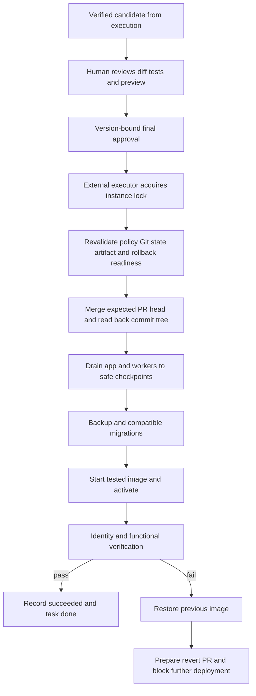

# Candidate approval, instance delivery and recovery

**Date**: 2026-09-19
**Status**: Draft
**Scope**: Specification only. Consume a verified candidate; do not implement an agent runtime.
**Companion**: [Agent execution and verified previews](2026-09-19-agent-execution-and-preview.md)
**Decisions and sources**: [Package map](2026-09-19-instance-development-infrastructure.md), [accepted decisions](2026-09-19-instance-development-decisions.md)

## TLDR

An authorized human reviews a verified candidate inside Open Mercato and gives one final approval for merge and deployment. An executor outside the application serializes changes to that instance, verifies the Git result, safely drains the application, and deploys the exact image already tested in preview. Failure restores the previous compatible application image, prepares an unmerged revert PR, and blocks further deployments until reconciliation.

## Problem Statement

The factory changes its own hosting application. Restarting that application cannot terminate the component responsible for recording deployment or restoring service. Approval of a moving branch, rebuilding after review, merging against a changed base, or treating a green health endpoint as full verification can deploy something the user never reviewed. Git state, database compatibility, task state and running image must remain explainable after partial failure.

## Overview and Success Measures

Primary outcome: from the candidate view, one authorized approval deploys the exact verified image to the configured hosting instance, or reports a specific block without silently expanding authority. Baseline: not implemented or demonstrated by this documentation task.

Acceptance targets: at most one delivery operation per instance; stale candidate/base/policy/approval never deploys; every tested crash boundary converges or requires attention; failed application activation restores the pinned previous image if its compatible rollback path remains healthy. Deployment success requires identity, functional API/browser smoke, and worker recovery proof. Recovery is deterministic and does not require remaining inference budget.

GitHub's merge API compares PR head using `sha`, not an expected base. Native GitHub merge queues validate combined revisions but introduce another candidate lifecycle; the initial executor uses a serialized direct merge and readback contract. The source map documents this evidence and the unsupported merge-queue case.

## Goals

| ID | Required behavior |
|---|---|
| DL-01 | Bind one explicit human approval to an immutable verified candidate and current authorization. |
| DL-02 | Serialize delivery and reject stale bases, protected changes, policy drift and unsupported repository rules. |
| DL-03 | Reconcile merge results and deploy the same tested image without rebuilding. |
| DL-04 | Drain safely, validate compatible migrations/backups, activate and verify the application. |
| DL-05 | Recover partial operations, roll back safely and prepare a revert PR after failed deployment. |
| DL-06 | Keep task state, UI, audit and retained rollback resources consistent with observed runtime. |

## Non-goals

Coding execution, model-driven merge approval, automatic destructive migrations, self-updating factory controls, automatic merge of recovery PRs, multi-host HA, Kubernetes, provider purchase, framework upgrades, remote access during the local phase, or bypassing GitHub protections. Source merge is not deployment success. No second mandatory human reviewer beyond configured permissions; a repo demanding one remains blocked until a human resolves its policy.

## Proposed Solution

Add delivery records and commands to `tasks`, reusing the existing code change/task identity. The external supervisor package owns one delivery executor with a durable operation journal, instance lock/fence, artifact store, protected policy, GitHub delivery adapter and deployment driver. It runs independently of the app and uses separate credentials from coding execution. Split these privileges into service processes or capability-limited adapters, not new business modules.

Application approval commands submit a structured, scoped request. They cannot submit arbitrary images, repository URLs, SQL, shell commands or traffic routes. The executor resolves a previously registered candidate and rechecks its provenance, installation policy, enrollment and fresh approval before any privileged side effect. Protected policies and service binaries are updated only through an administrator path outside this self-delivery workflow.

### Design Decisions and Alternatives

| Choice | Reason | Alternative | Why not initial scope |
|---|---|---|---|
| External executor with durable journal | Survives app shutdown and can roll back | Workflow step performs deployment inline | Process disappears while deploying itself. |
| Exact image digest from preview | Reviewed/tested binary remains the release | Rebuild after merge | Introduces unreviewed dependency/build drift. |
| Merge commit with explicit head SHA and result/tree checks | Clear base/head ancestry and recovery record | Squash/rebase/merge queue | Different ancestry rules need qualified adapters. |
| Backward-compatible expansion only | Previous image remains valid after migration | Down migrations on failure | Can destroy data or be irreversible. |
| Automatic app rollback, unmerged revert PR | Restore service while preserving Git audit | Force-reset main or automatic revert merge | Destructive history or another unapproved release. |

## Domain Vocabulary and Business Rules

| Term | Invariant |
|---|---|
| Approval | Human actor + candidate manifest digest + expected current release + repository/base/head/tree + image digest + policy/checks/migration digests + scope/time. Append-only and single-use. |
| Deployment | Durable state machine for one installation/candidate/approval, with unique delivery request ID. |
| Desired release | Approved artifact and config identity. Not a floating tag or current branch tip. |
| Observed release | Executor readback of running image/container identity, database migration level and health/functional verification. |
| Recovery block | Instance-wide stop on new deliveries until Git/runtime/schema divergence is resolved and audited. Coding may continue if safe and separately within budget. |
| Safe checkpoint | Explicit durable wait with no active external side-effect lease, not merely workflow `PAUSED`. |

Delivery approval is different from plan approval. The final UI explicitly says Approve merge and deploy and shows what instance/all tenants are affected. Author or owner may approve only with a separately granted feature and external instance enrollment. Agent identity is categorically refused. Approval is invalidated by any head/base/candidate/profile/policy/migration/required-check change, request-changes, consent expiry, protected-path finding, or loss of approver authority before merge.

Default approval validity: 24 hours, administrator-configurable downward or upward through protected policy. This is a proposed technical freshness default, not an interview-selected timeout. Revalidate on execution; expiry never permits automatic renewal. Concurrency limits for coding and previews remain independent from the single delivery lock.

## Users, Permissions, and Scope

| Actor | Required capability and scope |
|---|---|
| Candidate viewer | Task ACL + `tasks.view`; `tasks.code.view` for source evidence. |
| Final approver | `tasks.deployments.approve`, task access, human identity and administrator-controlled instance deployment enrollment. Owner/author relationship is allowed, not sufficient. |
| Request changes | `tasks.runs.control` and task access; invalidates approval before creating a repair attempt. |
| Recovery administrator | `tasks.deployments.recover` plus external instance administrator enrollment; can acknowledge repaired divergence, not falsify verification. |
| Delivery executor | External machine identity bound to installation, immutable policy and single operation/fence. It alone receives merge/deploy privileges. |

One source deployment affects all tenants hosted by the instance. Tenant-admin roles cannot independently grant installation-wide deployment power. Resolve task tenant/org from stored candidate scope; enrollment is a separate explicit installation authority. API callers cannot override instance/repository/tenant IDs. Application service accounts and models cannot sign human approvals.

Trust limit: the reviewed hosting app and its identity service enforce the human session boundary. These documents do not claim resilience against a fully compromised identity authority. The external executor enforces candidate/operation/host-policy restrictions independently, but proving a physical human click against a malicious hosting app would require an independent authentication/approval factor and is outside the chosen initial trust model. Do not describe a plain app callback as cryptographic proof of user intent.

## Reuse and Ownership Map

| Capability | Reuse / owner |
|---|---|
| Task, change row, pending decision and run screen | Staff + tasks, extended additively. |
| Candidate manifest, tests, reviewer and preview | Execution specification owns v1 contract. Delivery verifies it, never recreates it. |
| Human decision workflow | App command with durable decision record; orchestrator displays/consumes outcome through its adapter. Final approval is not an auto-disposed model proposal. |
| Deployment lock/journal/credentials/artifacts | External supervisor; app is a scoped projection and request origin. |
| GitHub | Provider records PR and merge; executor verifies repository immutable ID and current rules. |
| Database migration state | Existing migration framework, invoked by approved job from the candidate image. No new migration engine. |

## Architecture and Data Flow



The executor, its journal, preview/auth gateways, image store and recovery mechanism are outside the replaced app containers. Existing installations must meet a documented deployment-driver contract: current app image/digest, stop/start/health commands, worker set, migration command, immutable config version and traffic target. Host paths/service names are fixed in protected installation configuration, not accepted from task code. The initial driver supports the supplied Compose topology; arbitrary existing custom hosting setups remain unavailable until explicitly qualified against this contract.

Local app/preview/control publishing remains loopback-only. VPS delivery is the same algorithm with administrator-provisioned HTTPS/firewall and backup storage. No wildcard tunnel is part of local delivery. A blue/green app slot is useful for preactivation startup checks, but this design permits a maintenance window and does not promise zero downtime.

### Candidate and approval binding

Consume exactly `candidateManifestV1` from the execution spec. Reject unknown schema major, missing evidence, platform mismatch, mutable tag, expired snapshot, unsupported build recipe or dependency/profile drift. Record manifest hash, `B` (base SHA), `H` (PR head), `T` (tree of H), image digest, required-check observations, independent review digest, migrations, policy epoch, previous release ID and approver identity. Required repository controls must be satisfied, not substituted with the agent reviewer. If a repo requires approvals the configured human/app cannot supply, show the unmet rule and remain blocked; never auto-relax it.

Approval API atomically inserts the approval plus delivery outbox after optimistic locking the candidate/change row. Duplicate same request/hash returns its original delivery; changed payload under the same key returns 409. After the executor accepts the request, the approval is reserved by exactly that deployment. It is consumed at the merge boundary; ambiguous merge response requires reconciliation, not a second blind request. Cancellation before merge invalidates approval; cancellation after merge is an incident/recovery request and cannot pretend the merge did not happen.

### Git consistency and races

Initial automatic merge method is `merge` (a two-parent merge commit). Before approval, the execution capability updates H to include the current B, tests tree T and freezes the image. Before merging, under the installation delivery lock:

1. Verify repository immutable ID, configured branch, PR belongs to it and is open/mergeable, current base exactly B, current PR head exactly H, H contains B, all required checks/review rules pass for the bound revision and the candidate remains valid.
2. Verify no protected paths/dependencies, new hooks/CI privileges, or external install-policy changes. Confirm expected previous running release matches the approval. If base changed, queue a repair/update attempt through the execution contract; invalidate approval, rerun checks/preview/review and ask for a new final approval.
3. Submit merge with `sha=H` and `merge_method=merge`. No auto-merge queue or background branch updater can independently act on this PR. Installation qualification must detect conflicting auto-deploy/merge automation; disable the automatic delivery capability until the operator reconciles it. This includes the pre-publication CI qualification required by the execution spec; an unchanged privileged workflow executing modified tests is unsafe.
4. Read merged commit M from GitHub/Git objects. Require parents exactly B and H in expected order, `tree(M)=T`, PR merged status/head correspondence, and current target ref M. Record M separately from build source H. Deploy the existing image built from H/T; do not relabel its provenance as built from M or rebuild it.
5. If a race moved the base between checks and merge, M's parent/tree checks fail. Mark `merged_unapproved_base`, do not deploy, block the instance and require recovery. If a later external push advanced the target ref, also block; do not deploy an older approved image as if it were current main. A local lock cannot prevent unrelated GitHub actors from writing.

This catches an unapproved Git result before deployment, but cannot undo an already-completed merge atomically. Repository qualification should restrict routine target-branch updates to the controlled merge path, with administrator emergency access audited. If the product requires preventing even a raced merge, it needs a qualified exclusive-writer policy or transactional merge-queue integration; this design does not claim the REST API offers expected-base compare-and-swap.

New commits after review invalidate approval even when tree contents are identical: provenance and checks changed. Candidate build does not depend on merge timestamps or the eventual merge SHA. Runtime version endpoints expose both built-from H and delivered-as M. In local-to-VPS movement, CPU architecture must match the tested image; rebuilding for another platform produces a new candidate and needs new evidence/approval.

### Deployment state machine

`requested -> validating -> merging -> merged -> draining -> backing_up -> migrating -> activating -> verifying -> succeeded`.

Before merge: `blocked`, `stale`, `cancelled` are no-side-effect exits except durable audit. After merge: any failure transitions to `recovering`, then `rolled_back` if old service is verified or `recovery_failed` if not; both leave `instance.recovery_block=true`. If the current image never changed, recovery verifies it and records `unchanged_previous_release` rather than falsely claiming a rollback occurred.

Every step persists operation intent and its idempotency identity before side effects, then observed result. On restart, query GitHub, migration ledger, containers, proxy and artifact pins before continuing. Exactly matching observation may complete the step; zero effect permits a safe retry under the same fence; contradictory or unknown observations require manual attention. Lease expiry alone does not authorize a second executor to race a still-running migration or merge. Recover ownership and process identity first.

### Drain and activation

Draining changes the external installation admission epoch to DRAINING, refusing new starts and new side-effect leases. Existing bounded agent/tool activities finish or reach approved durable waits; queue admission/reconciliation is aware of the epoch. Do not send an arbitrary SIGTERM and call it a safe checkpoint.

Safe: terminal workflow, explicit USER_TASK or named WAIT_FOR_SIGNAL with no active external run/inference/mutation lease, and all branches safe for a fork. Unsafe: RUNNING, WAITING_FOR_ACTIVITIES, unacknowledged side effect, active OpenCode/agent call or unknown pause reason. Existing paused human work remains persisted. Before final drain acknowledgment, the app/worker set confirms no active writes and the executor checks its own leases. A model call timeout may checkpoint through its normal execution policy; delivery does not force-kill it to meet a deadline.

Proposed drain deadline: ten minutes, configurable in protected policy. Expiry fails delivery, reopens safe application admission, verifies the old app and prepares Git reconciliation because merge may already have happened. Show `merged; deployment blocked at drain`, not Done. No silent drop of in-flight requests or task signals.

Once safely drained, enable maintenance/write barrier, stop all old app workers and schedulers, take the backup, apply only approved migrations, launch candidate app/worker set against the installation's existing scoped configuration, and perform preactivation health checks. Freeze new worker consumption until activation ownership transfers. Switch the configured loopback/VPS proxy target, then run identity and functional verification. Keep the previous image/config/migration compatibility manifest pinned throughout. Only after success release admission on the new epoch and acknowledge durable callbacks.

### Migrations and backup

Automation permits only expand-style changes compatible with both previous and candidate app/worker code. A schema migration triggers human plan approval before coding. Final manifest contains SQL and snapshot digests, migration IDs/order, affected objects, expected migration ledger, lock/statement timeouts, backup scope and old-code compatibility evidence. Classify unknown SQL as manual-only. DROP, rename/removal, incompatible type or meaning changes, mandatory non-null without a compatible rollout, irreversible transformations and privilege changes are refused. Even ADD COLUMN can lock or break old inserts; additive syntax alone is insufficient.

Before merge validate backup tooling/storage/quota/restore qualification and compatible rollback image availability. After drain, take a transactionally consistent instance backup of databases plus required uploads/config metadata, encrypted with external secrets excluded. The installation administrator authorizes instance-wide backup scope; task-level snapshot consent does not authorize it. Record backup ID, digest/manifest, completion and a restore verification receipt against the approved recipe. Default: restore into an isolated verification database and run integrity checks before live migration; if that cannot finish within the configured maintenance budget, fail the deployment and restore normal old-app operation. Never test restore over the live database.

Run migrations using the tested image as a bounded job, without application traffic. Use the framework migration ledger plus executor intent/observed record. Prefer transactional migrations; a failed/unknown partial migration pauses for observed-state reconciliation before any retry. Rollback switches code/config while retaining compatible schema additions. It never automatically restores the database backup or runs down migrations; those may lose post-backup writes and need a separate administrator decision. If the actual schema is not known compatible with the old image, do not activate it blindly: keep maintenance and report recovery_failed.

### Verification and recovery

Required verification: running image digest equals approval, runtime reports H/T/M as expected, migration ledger equals approved result, app health responds, authenticated representative API/browser smoke for affected functionality succeeds, workers can process a synthetic scoped fixture and reattach pending workflow callbacks, and error/health observation remains clean for a proposed two-minute window. Synthetic fixtures clean themselves up. A single HTTP 200 is insufficient.

If verification fails, stop candidate consumers, switch to and verify the previous pinned app/worker/config identity, keep compatible schema additions, and record the failed artifact and cause. Deterministically prepare a revert of M (merge mainline parent 1), starting from fresh current target. Run without an LLM or inference budget. Use a normal new branch and draft PR, do not reset main or merge the revert. Detect an existing recovery branch/PR by operation marker before retry. Git conflicts or protected-file changes remain manual; retain an actionable recovery artifact even when GitHub is unavailable.

Block all later deliveries until an authorized recovery administrator resolves Git/runtime/schema identity through a reviewed revert merge and records evidence. A forward repair with a new candidate is a separate administrator-operated recovery procedure outside the automatic delivery queue: the administrator records a fresh candidate-bound recovery approval, acquires the same installation lock with an incident-scoped operation ID, revalidates the candidate/backup/schema, uses the protected installation driver to activate its exact image, performs the same identity/functional checks, and supplies those immutable receipts to the resolution command. The ordinary approval/queue path remains blocked throughout; there is no implicit bypass flag. Clearing a boolean is insufficient. For revert recovery, the resulting Git tree must match the observed restored image source tree (compatible retained schema additions are recorded separately); divergent unrelated commits require a reviewed reconciliation rather than falsely declaring equivalence. The resolution command checks current Git, running image, migration compatibility, open recovery operation and retained backup state. Do not create recursive automated deployment from the recovery PR itself. All rollback and reconciliation steps run independently of inference-budget exhaustion.

## User Journeys

J-DL-1: User opens candidate in the existing run view, sees version/base, diff/files, independent review, tests, migration/impact summary and preview, then chooses Approve merge and deploy. The dialog names the hosting instance, affected shared code and exact candidate. The timeline shows validation, merge, drain, backup, migration, activation and verification. Only observed success marks the task Done and releases the delegate.

J-DL-2: Another PR changed the base -> candidate becomes stale -> task returns to a bounded repair attempt -> new tests/review/preview -> previous approval visibly revoked -> new final approval required. Multiple PRs may remain open; deployment requests are serialized, revalidated on dequeue and never batch-approved.

J-DL-3: Activation fails -> old service is verified -> UI shows Rolled back, retained schema additions, failed check, running vs Git version and recovery PR status -> further deployment button disabled with reason. If app is unavailable, administrator reads the executor's local status/CLI; durable outcomes are imported into the UI after recovery.

J-DL-4: Human requests changes before merge -> invalidate approval and delegate a new attempt on the same task/branch/PR. Terminate without deployment stops this delivery path and retains evidence. After merge the UI offers recovery, not a misleading no-effect cancel.

## UI and Interaction Contracts

Reuse [backend UI guide](../guides/backend-ui.md), [example page shell](../../src/modules/example/backend/todos/page.tsx), [TodosTable](../../src/modules/example/components/TodosTable.tsx), and the execution spec's existing run view. No second review dashboard or Kanban board.

| Surface | Data / actions | States and canonical components |
|---|---|---|
| Candidate section in `/backend/tasks/{taskId}/runs` | Deployment eligibility and approval/reject commands | Standard detail sections, check `DataTable`, shared buttons and guarded dialog. Eligible/stale/blocked/approval expired/permission denied. |
| Delivery timeline on same page | Deployment projection and safe error details | Semantic badges, grouped step list, observed and desired versions; polling fallback after SSE reconnect. |
| `/backend/settings/tasks/infrastructure` recovery section | Current release, block reason, backup and recovery PR refs | `DataTable` history; guarded recovery resolution dialog, read-only protected policy. |
| External local executor status | Read-only operational command when app down | Installation/deployment IDs, safe phase/error, current/previous digests; never credentials. |

```text
Candidate 7    Tested source H    Base B    Image sha256:...
Diff | Checks | Independent review | Preview
Deployment impact: instance-wide code; additive migration summary
[Request changes] [Terminate without deployment] [Approve merge and deploy]
Delivery: Validate -> Merge -> Drain -> Backup -> Migrate -> Activate -> Verify
Running release / Git release / recovery status
```

Approval is a custom command dialog, not generic record editing; it uses shared dialog/form controls and optimistic headers. Cmd/Ctrl+Enter confirms only when the explicit dialog is focused; Escape cancels. Required checked facts and failures are text, not color alone. Loading/empty/offline/conflict/recovery states preserve user input and prevent duplicate submission. `apiCall`, `LoadingMessage`, `ErrorMessage`, semantic tokens, `tasks.*` translations, focus restoration, keyboard navigation, narrow-width layout and light/dark coverage follow the execution spec. Display named task/instance/repository references, not raw IDs. No requirement to open GitHub for ordinary approval; link to GitHub remains optional for auditing.

## Data Models

All tasks-owned rows are scoped by trusted tenant/org; cross-module links are IDs. Mutable projections expose `updated_at`/`updatedAt`; immutable approvals and operation receipts are append-only.

| Record | Minimum fields / invariants |
|---|---|
| Approval | ID, task/change/candidate IDs, manifest hash, human ID, enrollment/policy epoch, B/H/T/image, previous deployment ID, requestedAt/expiresAt, request ID, decision, consumedBy; unique request ID per installation. |
| Deployment | ID, installation, approval, candidate digest, expected previous release, state/reason, fence, step/operation sequence, M, observed image/schema, started/finished; one active operation per installation enforced by unique lease record. |
| Release | immutable source/image/config/migration/evidence identity, parent release, activatedAt, verifiedAt, result; never a floating branch pointer. |
| Recovery | failed deployment, previous release, backup refs, rollback observations, revert operation/PR, resolution evidence and resolving human. |
| Artifact pin | artifact/dataset/backup identity, owning deployment/recovery, reason, acquiredAt/releasedAt; atomically shared with cleanup admission. |

Supervisor journal is authoritative while the app is offline. Tasks stores an idempotent encrypted projection with last received sequence. A gap triggers resync, not guessed status. Approval actor/reason and safe error details follow encryption/access conventions; images/source artifacts inherit code-view requirements. The instance-level release journal is not exposed wholesale to a tenant: return only the linked authorized task's delivery and allowed installation summary.

Pin current release, last known-good rollback release, required backups and every unresolved recovery reference. The execution spec's seven-day cleanup cannot delete them. After a later verified release and resolved incidents release obsolete pins under retention policy; default keep at least two verified releases and seven days of backup recovery coverage. Required storage admission fails before merge if reserve is insufficient. Audit uses the package's separate retention policy.

## API, Command, and Error Contracts

Proposed additive guarded command routes. Resolve candidate/task/installation from stored scope, enforce feature plus external enrollment, validate zod/OpenAPI, optimistic version and idempotency body hash. Standard errors: 400 validation, 401 auth, 403 feature, scoped 404, 409 stale/version/state/policy conflict, 410 expired approval/candidate, 429 busy admission, 503 executor/GitHub/identity unavailable.

| Method / route | Input | Result / guard | Requirement |
|---|---|---|---|
| GET `/api/tasks/candidates/{id}/delivery-eligibility` | candidate ID | all blockers, expectedVersion, current base/release, safe policy summary | DL-01/02 |
| POST `/api/tasks/candidates/{id}/approve-deployment` | requestId, expectedVersion, manifestHash, expectedPreviousReleaseId | 202 approvalId/deploymentId, `tasks.deployments.approve`, human-only | DL-01 |
| GET `/api/tasks/deployments/{id}` | ID | sequenced state, B/H/M/image, verification, recovery refs | DL-06 |
| POST `/api/tasks/deployments/{id}/cancel` | requestId, expectedVersion, reason | 202 only pre-merge; 409 recovery_required after merge intent may have executed | DL-01/05 |
| POST `/api/tasks/deployments/{id}/resolve-recovery` | requestId, expectedVersion, resolution evidence IDs | 202 reconciliation, not immediate unblock; recover feature + admin | DL-05 |
| POST internal `/api/tasks/delivery-receipts` | operationId, sequence, digest, state ref | durable 202 or hash-conflict 409; installation service identity | DL-06 |

Commands: `tasks.deployment.approve`, `tasks.deployment.cancel`, `tasks.deployment.resolve_recovery`. Network side effects occur after committed outbox. No ordinary update/delete approval endpoint; revocation is a new audited event. Executor `/v1/deployments` accepts only registered manifest+approval IDs with request ID and fence; `/v1/deployments/{id}` returns safe status. App cannot send raw deploy commands. Approval cannot bypass executor validation.

## Events, Jobs, Notifications, and Cross-Module Flows

Publish `tasks.deployment.updated` and `tasks.deployment.recovery_required` after durable projection commits, with scoped task/deployment IDs, sequence and state. Use DOM event bridge to refetch, not as a durable delivery channel. Notifications go to permissioned task owner/approver and instance administrators with scope-appropriate detail.

Executor independently polls/reconciles GitHub when local callbacks/webhooks are unavailable. Local mode needs no public webhook. Future VPS webhook receiver must verify signature and deduplicate delivery IDs; this is an optimization, not sole correctness mechanism. Do not configure it during documentation work.

Delivery success calls existing process-safe task status/link commands through the version-bound adapter, checks active delegation/fence, and releases the delegate. Task is `in-review` while awaiting approval; deployment phases appear as run substate without creating arbitrary staff columns. Failure moves to the agreed closed/failed outcome with recovery detail after safe recovery; it never overwrites a new delegation. In execution-only mode, candidate-ready remains in review for the user to complete through the legacy process; it never pretends deployment succeeded.

## Security, Privacy, and Compliance

External executor owns Docker/deploy and merge capability; sandbox and generated app never receive these secrets. Broker operation allowlists differ for coding and delivery even if the same GitHub App installation issues their server-held tokens. Least-permission installation tokens and immutable repository IDs reduce scope; they are not branch-limited credentials. Secret issuance, GitHub App setup and repository policy changes are separate administrator operations.

Protected path policy covers deployment machinery, grants/ACL, approval validation, budgets, secret plumbing, dependency/toolchain pins, CI workflows and scripts that can alter those controls. Classify transitive control changes too: renaming/moving a protected file, changing a dynamically loaded module or modifying tests to hide a control change does not bypass review. Unknown control impact yields proposal-only/manual delivery. The policy itself and trusted verifier live outside candidate control. This is a fail-closed change-classification gate, not a proof against all malicious application behavior.

No candidate receives production data before deployment. During deployment the reviewed application necessarily gets its normal runtime data permissions; sandbox isolation is not a claim that arbitrary deployed application code is harmless. Authorized human review, baseline checks, protected policy and instance-wide permissions are required together.

Backup data is instance-scoped and encrypted; task users see receipts, not backups or keys. Logs redact tokens/headers/SQL parameter values and restrict raw errors to authorized diagnostics. Profile commands cannot exfiltrate deployment secrets because execution sees only constrained runtime/migration credentials required for its approved job, not GitHub/host-control keys. Migration jobs are treated as privileged reviewed code and require explicit SQL/compatibility gates.

## Integration Coverage

Self-contained fixtures: fake GitHub with controllable races, two tenants and permission tiers, fake executor drivers with fault injection, two candidate images and compatible/incompatible migration fixtures, isolated restore database. API/browser tests cover every method in the route table with allowed/denied/stale/replay cases. Real Docker qualification proves traffic/image/process observations without contacting production services.

| Test | Actions and oracle |
|---|---|
| DL-T01 | Owner/author with feature can approve; same identity without enrollment cannot; agent cannot; tenant mismatch hidden; double click produces one operation; changed hash under same key rejected. |
| DL-T02 | Head/base/check/reviewer/policy/previous-release changes before dequeue invalidate approval; request-changes revokes it; no merge occurs. |
| DL-T03 | Inject base advance between precheck and merge, external post-merge push, wrong tree/parents, uncertain merge response: no unapproved deployment; truthful merged-but-blocked outcome and no duplicate merge. |
| DL-T04 | Two simultaneous delivery requests serialize; drain refuses new starts, preserves human waits, inspects all fork branches, times out without forced restart; admission recovers safely. |
| DL-T05 | Additive compatible migration with verified restore succeeds; destructive/unknown SQL or missing backup/old image rejects; partial migration never auto-replayed or down-migrated. |
| DL-T06 | Image/provenance/platform mismatch blocks; passing health with failing functional smoke rolls back; previous workers/config/image and schema compatibility verified; no rebuild after approval. |
| DL-T07 | Kill executor/app at every persisted boundary, including merge/migration/proxy switch: reconcile exact observed effect or require attention; sequence gaps resync. |
| DL-T08 | Inference pool exhausted, GitHub unavailable, revert conflict, existing recovery PR: deterministic rollback still runs; retry never duplicates revert; later deploys remain blocked; a manually approved incident-scoped forward repair records the exact new image and full verification, then resolution clears the block while unrelated queued deliveries remain unexecuted and require revalidation. |
| DL-T09 | Cleanup races rollback/backup pin; pins win atomically; recovery resolution refuses unverifiable Git/runtime/schema divergence. |
| DL-T10 | Browser: full diff-to-approval flow, changes requested, stale approval, cancel boundary, rolled-back/recovery views, permissions, light/dark/narrow, keyboard and conflict states. |
| DL-T11 | Shared-instance tenant user attempts granting itself deploy enrollment; protected control/CI/profile changes cannot pass auto-delivery; forged/replayed callback rejected. |

## Implementation Phases

Future work only, no implementation approval implied.

### DL-P1: candidate eligibility and human approval

Depends on execution candidate v1 and scope/identity contracts. Implement scoped immutable approval, eligibility checks, protected policy, delivery outbox and UI dialog/timeline using a dry-run executor that cannot merge. Steps: model/command/idempotency; safe eligibility adapter; UI and auth tests. Close DL-01 via DL-T01/02/10/11. Exit: one correctly bound request, stale or unauthorized requests never enqueue; UI labels the dry-run mode and cannot claim deployment.

### DL-P2: serialized merge and observable delivery to a fixture instance

Depends on P1 plus qualified GitHub policy and deployment-driver contracts. Implement lock/fence/journal, exact-head merge/readback, drain, image verification, app/worker activation and all associated safe recovery handling for schema-unchanged fixtures. Steps: provider adapter/race tests; drain and driver; full success/failure fixture with independent executor. Close DL-02/03 and schema-unchanged DL-04/05 via DL-T02/03/04/06/07/08. Exit: exact tested image deployed or previous service verified, with a blocked recovery PR when merge preceded failure. Never enable real deliveries with rollback deferred to another phase.

### DL-P3: compatible migrations and durable recovery

Depends on P2. Add backup admission/restore proof, migration manifests/classifier, partial-failure handling, retained pins, recovery resolution and scoped audit projection. Steps: compatible/forbidden migration fixtures; backup and schema reconciliation; cleanup/race tests and UI. Close remaining DL-04/05/06 via DL-T05/07/08/09/10/11. Exit: an additive migration can deploy and roll back code without data restore; incompatible/unknown changes are blocked before privileged work.

### DL-P4: installation qualification and VPS portability

Depends on P3. Document/install the driver into an existing local instance, record host/process/storage capacity, verify administrator emergency recovery, then qualify the same contracts on a separately approved VPS. No automatic purchase or remote exposure. Exit: local qualification evidence matches instance/source/image/platform, and VPS readiness is explicitly separate until its DNS/TLS/firewall/backups and tests pass.

Validation each phase: Corepack Yarn generate/typecheck/lint/ds:check/test/build plus route-specific `test:integration:ephemeral`, driver/GitHub fault fixtures, image and restore verification. Never change repository protections, apply migrations to the user's runtime or trigger an actual merge merely to validate this documentation.

## Requirement Traceability

| Requirement | Journey / contract | Phase | Test | Acceptance |
|---|---|---|---|---|
| DL-01 | J-DL-1/4, approval API/binding | P1 | T01/T02/T10 | A01 |
| DL-02 | J-DL-2, lock/policy/repository checks | P2 | T02/T04/T11 | A02 |
| DL-03 | Git consistency, candidate manifest | P2 | T03/T06 | A03 |
| DL-04 | J-DL-1, drain/backup/migration/verify | P2-P3 | T04/T05/T06 | A04 |
| DL-05 | J-DL-3, journal/recovery/revert | P2-P3 | T07/T08/T09 | A05 |
| DL-06 | J-DL-1/3, projections/task outcome/pins | P3 | T09/T10 | A06 |

Prefixes omitted in phase/test/acceptance cells are `DL-`. Exact source-present reference capabilities:

| Extension | Capability ID / reference file | Classification | Phase / test |
|---|---|---|---|
| Approval/deployment projection entities | `data.entities`: `src/modules/example/data/entities.ts`; `data.encryption-map`: `src/modules/example/encryption.ts` | emitted-example | P1/T01,T11 |
| Approval/recovery features | `module.acl-features`: `src/modules/example/acl.ts` | emitted-example | P1/T01,T11 |
| Guarded approval/recovery commands | `commands.write`: `src/modules/example/commands/todos.ts` | emitted-example | P1-P3/T01,T07,T09 |
| Eligibility/approval/status/recovery/receipt routes | `runtime.bulk-operation-progress`: `src/modules/example/api/todos/bulk-complete/route.ts` | emitted-example | P1-P3/T01,T02,T07,T09 |
| Event definitions | `events.typed-definitions`: `src/modules/example/events.ts` | emitted-example | P1-P3/T07,T10 |
| Outbox/receipt worker | `runtime.bulk-operation-progress`: `src/modules/example/workers/todos-bulk-dispatch.ts` | emitted-example | P1-P3/T07 |
| DI adapter registration | `module.di-registration`: `src/modules/example/di.ts` | emitted-example | P1/T01 |
| Existing run/settings UI additions | `ui.page-shell`: `src/modules/example/backend/todos/page.tsx` | emitted-example | P1-P3/T10 |

Each route is a distinct fixture case; task status/link integration must be verified against the installed SPEC-002 command contract before enabling the process version. External executor driver is not a module-discovery surface and is qualified by DL-T03 through DL-T09, not falsely classified as an emitted example.

## Rollout, Migration, and Rollback

### Migration & Backward Compatibility

The delivery capability is administrator-enabled per installation only after execution candidate v1, protected external policy and compatible driver are qualified. Add tasks-owned state without removing existing change fields/routes. Keep delivery protocol/schema version explicit; incompatible candidates are rejected with a visible error. Preserve legacy non-code/GitHub-review processes; process definitions already running keep their version.

New delivery-enabled process retains task ownership until verified deployment; manual staff `in-review -> done` must be intercepted for that mode so it cannot bypass runtime verification. Existing legacy mode keeps its documented behavior. Roll back feature admission before code: stop new delivery requests, finish or reconcile active operations with the external executor, then disable the app surface. Never uninstall the journal, old image or recovery driver while an unresolved deployment exists.

## Risks and Tradeoffs

| Risk | Mitigation | Residual |
|---|---|---|
| Base race at GitHub merge | Exact head/base precheck, merge parents/tree/ref readback, exclusive-writer qualification | REST API cannot atomically compare expected base; merge may already exist when detected. |
| App self-deployment corrupts control path | External privileged executor/journal/policy, protected path rules | Trusted app identity boundary remains; malicious app compromise is not solved by code review. |
| Migration falsely classified compatible | SQL + old/new code tests, restore proof, unknown means manual | Application semantics need human review. |
| Single host fails entirely | Retained immutable artifacts, backup recipe, offline recovery docs | No HA or automatic host replacement is promised. |
| Rollback restores code but Git stays advanced | Block further deployment, deterministic revert PR, observed resolution | Human resolution may delay later delivery. |

## Acceptance Criteria

- DL-A01: only an enrolled authorized human can create one approval bound to current candidate evidence; agent, stale and replay-mismatch attempts fail.
- DL-A02: one active deployment per instance; a changed base or protected control cannot reuse approval.
- DL-A03: merged tree/parents and current target pass the contract, and observed runtime uses the exact tested image digest without rebuilding.
- DL-A04: safe drain preserves waits, proven backup precedes compatible migration, and identity plus functional verification gates success.
- DL-A05: each injected failure recovers the previous compatible service or honestly reports recovery_failed; deterministic revert PR and deployment block survive empty inference budget.
- DL-A06: task Done means observed success in delivery mode; UI/audit/pins reflect actual Git/runtime/schema and cannot leak another tenant's task.

## Final Compliance Report

| Check | Status | Evidence / gate |
|---|---|---|
| Scope cohesion | Draft-defined | Candidate consumer; no coding/runtime implementation. |
| End-to-end and recovery contracts | Draft-defined | Approval through rollback/revert, no deferred recovery in first real delivery phase. |
| Data/API/UI/test traceability | Draft-defined | DL-01..06 and T01..11; framework task commands require version qualification. |
| Driver/provider conformance | Not executed | GitHub race, safe drain, backup restore and compatible rollback tests defined, not run. |
| Independent architecture/security review | Pass for draft handoff | Architecture/scope and security reviewers rechecked corrections on 2026-09-19; no open findings. This does not certify runtime behavior. |
| Implementation authorization | Not granted | Documentation-only request. |

Verdict: Blocked - installation/provider conformance gates and implementation authorization remain; no deployment readiness claim.

## Open Questions

No unresolved product question from the interview. DL-Q1: infrastructure owner must qualify the installed worker/process safe-checkpoint adapter and Compose driver; DL-Q2: repository administrator must establish compatible merge rules and absence of competing deployment automation; DL-Q3: data/operations owner must qualify backup/restore and old/new schema compatibility. These are explicit installation/implementation gates, not requests for the user to answer facts discoverable from the system.

## Changelog

| Date | Change |
|---|---|
| 2026-09-19 | Initial companion specification after D-037; approval, merge, exact-image deployment and recovery contracts. |
